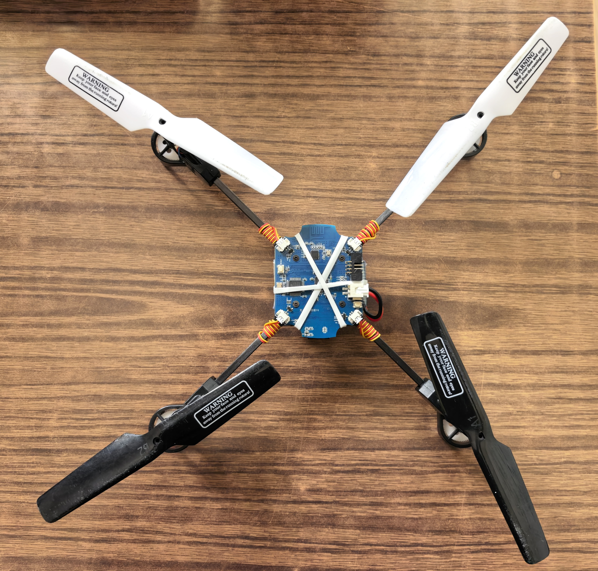
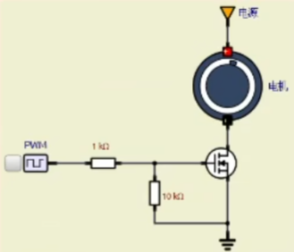
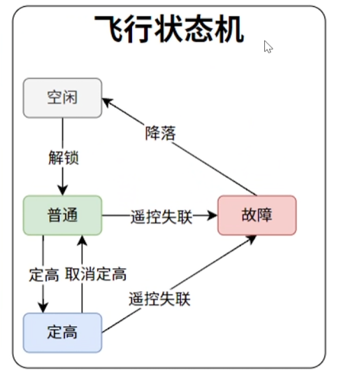
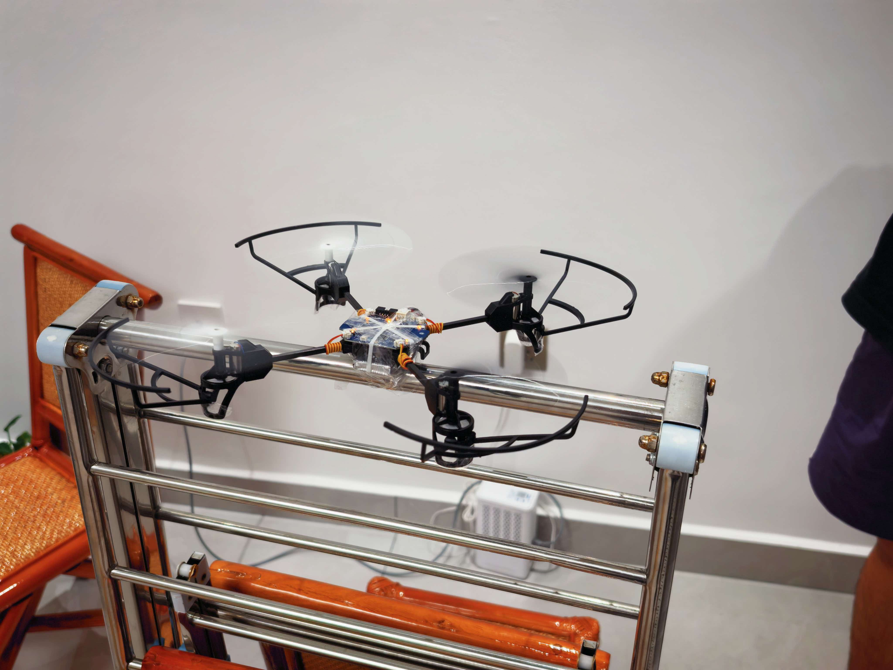
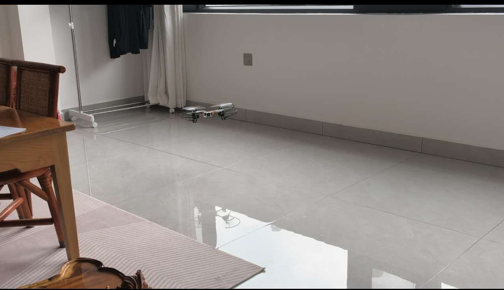
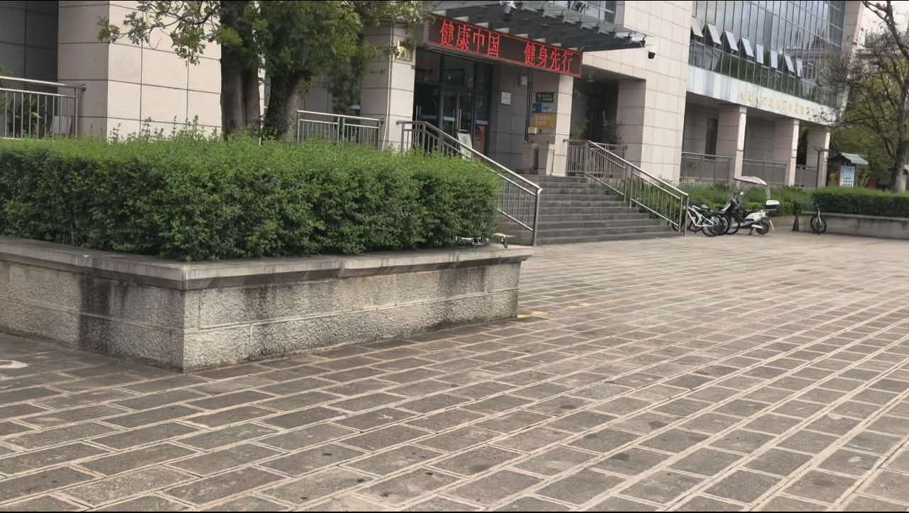

# Readme of Triple\-j UAV

## 1 总述

我们计划站在无数无人机开发先辈的肩膀上设计出一款：

1、能够保持飞行姿态稳定

2、通过三个角度的控制进行四个自由度的遥控（升降z，前后x，左右y，偏航旋转Yaw）

3、实现定高飞行功能

\.\.\.

的全环节可拓展无人机。并且期望随着我们个人能力的进步，不断革新这款无人机。我们会将其开源至github\(https://github\.com/AIYAA\-1011/triple\-J\-\-\-UAV\)，记录版本迭代的同时诚心希望可以吸引志同道合的朋友加入我们！

该项目使用stmcubemx \+ keil ＋ vscode联合开发

软件基于FreeRTOS实现多任务并发与资源管理

控制算法使用串级pid

## 2 硬件选型

在硬件组成方面我们选用**传统x形架构**：

在动力系统选择中，我们采用**空心杯直流电机：**

电机驱动选用“**PWM\+MOS管**”的方式：

**电源系统\-电池采用**：3\.7V \& 2000mAh的锂电池

**电源系统\-电池芯片**：**IP5305T**

**飞控系统\-主控芯片**：**STM32F103C8T6**

**飞控系统\-传感器**：

1、**MPU6050**:

功能：飞行姿态可通过欧拉角\(Eulerangles\)进行描述,欧拉角是一种用三个角度来描述刚体在三维空间中取向的方法。

通信接口：IIC

2、**VL53L1X**：

功能：测量飞行高度

通信接口：IIC

**通信系统**采用2\.4G无线信号收发器，接口采用SPI

## 3 软件实现思路

### 3\.1 无人机飞控

### 3\.2 遥控器

### 3\.3 状态机

## 4 当前遇到问题及待验证解决思路及未来展望

### 4\.1 问题 

1、经过几轮测试后无人机在启动开始时候，转动的旋翼不固定，即不能稳定的四个空心杯直流电机同时以相同功率转动，只能操作遥控器以期抵消误差。

2、起飞之后向前，右前，右方向飘移概率几乎均等，当飞行过高时候有反转与自旋风险

3、定高功能验证存在，但飞行时候体感像是没有

### 4\.2 思路与展望

1、将进行更进一步的调参，希望可以在无风环境下根治以上问题1 2

还可以尝试调节姿态结算滤波参数

2、尝试替换硬件选型，使用更稳定的电机

3、进一步添加绝对位置的计算，实现简单路径（直线和弧线）的位置记忆与归位

4、尝试将飞控移植到更强的芯片上，更新无人机，以期对更多算法的探索

\.\.\.

## 鸣谢

感谢triple j（名字里都有杰的三个人组成的团队） 如果没有大家就不会有可以飞起来的第一个版本

感谢上海大学张进老师的支持 如果没有您的提议与部分的经费支持就不会有项目的成立

感谢b站尚硅谷 为我们提供了近乎全套的实现思路

感谢每一个默默为此项目付出的人

2026/8/26 

雷理杰 编

杨施杰 

段俊杰 审

